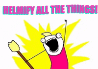

# About

Hi Everyone,

I'm an `SRE` from Kochi, Kerala, currently working at `Sedai` as `Senior SRE`. I started off as a Software Engineer at `Sedai` in the Operations team involving in the design and implementation of the infrastructure in AWS, GCP and Azure, including the `CI/CD`. Being a startup, it gave me the opportunity to directly work with everyone and be hands-on everywhere including other parts like access control and cost management. Currently my role is to help with the product research and design, creating and testing POCs and streamlining existing tools and methods.

This interest started with me trying out various linux distros, fine tuning them and furiously writing shell scripts to automate my experience in every possible way. This lead to the usual rabbit hole of spending more time improving my workflow than actually working. But I ended up working with docker containers which inevitably lead to the mother of all container management tools - `Kubernetes`. `Kubernetes` lead me to managed services by AWS, GCP and Azure and hence other tools by these cloud providers. `ECS` was also part of my work but every time I used it I ended up thinking how much more flexible it would be with `EKS`. 

Don't get me wrong - `ECS` is much easier to setup and use for smaller applications with only a few services. I later got my certification in `Terraform` - [HCTA0-003](https://www.credly.com/badges/519f50a3-5301-423e-b408-184fcfca2a82/linked_in_profile) after using it for almost all the infrastructure management. Cloudformation is also used a lot - but it's still finicky at times.

---
Now to the non-techie side of things for a break.

After trying out hobbies and losing my patience in them quickly, I decided to get try out motorcycles. Watching my friends and family having the time of their lives on two wheels and a backpack was very enticing. Then I remembered a scene from `Tron: Legacy` 

If you know this scene then you'll remember Daft Punk blaring the `The Son of Flynn` while Sam whizzes through the traffic in his Ducati. This was the push. So I took my license quickly, bought a bike and started touring whenever I needed to recharge. Then I got another one and I realized - `Damn, I finally got a hobby that's going to stick forever`. 

---
Let's get back on track. I love getting challenging tasks and being hyperfocused on them. DevOps is such an wide area that there are always better tools and methods to improve the current approach, this complements the work I do since it's possible to always improve on oneself and the task at hand. It's similar to how riding a motorcycle works - you're constantly getting new scenarios and roadblocks which you have to overcome. You're constantly learning, improving, testing and improvising. And the satisfaction of automating things as much as possible is a bonus.

This doesn't mean it's the ultimate area to work in. It's equal to every other part of a product's development. It only complements everything else. So currently I'm on the track of learning - primarily the development side of a product to understand it better and to help with the infrastructure design more.

This site is where I will be updating the progress and projects along with the journey in any of the areas above.